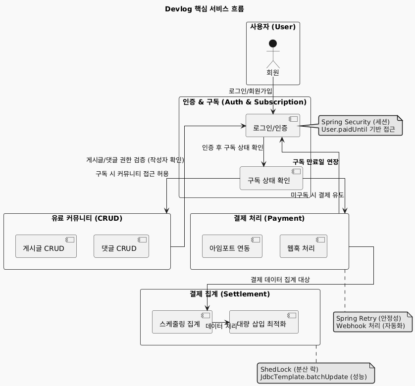
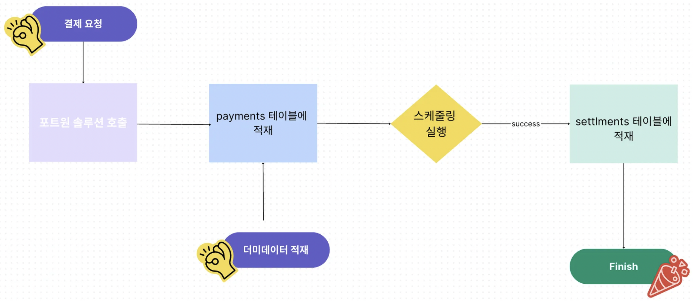

# 🚀 DevLog: 구독 기반 유료 커뮤니티 백엔드 플랫폼

   

   

---

## ✨ 프로젝트 소개

**구독형 유료 커뮤니티 서비스를 위한 플랫폼, DevLog입니다.**

사용자 인증 및 구독 관리를 기반으로 안정적인 유료 커뮤니티 기능을 제공하며, 효율적인 결제 처리와 대규모 데이터 집계 시스템을 통해 지속 가능한 서비스 운영을 지원합니다.

---

## 💡 주요 기술 스택

### Backend
* **Java 21**
* **Spring Boot 3.5.5**
    * Spring Web
    * Spring Data JPA
    * Spring Security
    * Spring Retry
    * Spring Scheduler
* **Database**
    * MySQL 8.0.40
* **External API**
    * PortOne (아임포트) - 결제 Gateway
* **Etc.**
    * ShedLock
    * Lombok

---

## 🎯 주요 기술 성과 및 기여

### 1. 🛡️ 외부 API 실패 시 재처리 작용 (구독 결제 안정성 강화)
* **[문제 인식]** 
    * **구독 결제 시스템** 구축 시 외부 PG사(PortOne) API 연동 과정에서 네트워크 불안정 등 일시적인 통신 오류로 인해 결제 실패가 발생하는 케이스를 인지.
    * 결제 실패 시 사용자 경험 저하 및 비즈니스 손실 방지를 위해 **단순 롤백이 아닌 안정적인 재처리 방안**의 필요성 고민.
* **[해결 과정]**
    * `Spring Retry` 프레임워크를 도입하여, 외부 PG사 결제 API 호출 실패 시 **최대 2회 자동 재시도** 로직 구현.
    * 재시도 간격을 25초로 설정하여, 일시적인 서버 부하 해소 후 성공 가능성 증대 및 PG사 API 정책 준수.
    * 최종 재시도 실패 시에도 `recover` 로직을 통해 **실패 원인 로깅 및 관리자 알림** 등 후속 처리 작업이 실행되도록 개발하여 시스템 안정성 확보.
* **[결과]**
    * **외부 PG사 연동의 안정성을 대폭 강화**하여 **구독 결제 성공률을 높이고** 사용자 결제 경험 개선.
    * **일시적인 외부 요인으로 인한 결제 실패를 시스템 내부에서 자동으로 복구**하는 메커니즘을 도입하여 운영 부담 경감 및 서비스 신뢰도 향상.

### 2. ⏱️ 스케줄링 중복 실행 방지 개선 (결제 집계 시스템 안정화)
* **[문제 인식]** 
    * **결제 집계**와 같은 주기적인 스케줄링 작업이 다중 서버 환경에서 **중복 실행되어 데이터 불일치 및 리소스 낭비를 유발**할 수 있는 문제점 인지. 
    * 정확한 **결제 수익 정산 데이터**를 확보하기 위해 스케줄링 작업의 단일 실행 보장이 필수적이라고 판단.
* **[해결 과정]**
    * 별도의 스케줄링 서버 구축이나 DB 상태 플래그 방식의 복잡성을 고려하여, `ShedLock` 라이브러리를 통한 `Spring Scheduler` 중복 실행 방지 방안 모색. `ShedLock`이 **빠르면서도 리소스 사용량이 적다**고 판단하여 솔루션으로 채택.
    * `JdbcTemplateLockProvider`를 사용하여 데이터베이스 기반의 분산 락을 구현, 스케줄링 메서드에 `@SchedulerLock` 어노테이션 적용.
* **[결과]**
    * 로컬 환경에서 PORT 번호를 다르게 설정한 2대의 애플리케이션을 동시에 실행하여 `ShedLock`이 **한 대의 애플리케이션에서만 스케줄링 작업을 실행함**을 성공적으로 검증.
    * **다중 서버 환경에서 결제 집계 작업의 단일 실행을 보장**하여 데이터의 정확성과 시스템의 안정성을 확보하고, 정산 데이터 신뢰도 향상.

### 3. 🚀 정산 데이터 대량 등록 개선 (결제 집계 성능 최적화)
* **[문제 인식]** 
    * **구독 서비스의 사용자 및 결제 건수가 증가함**에 따라, 매일 수행되는 **결제 집계 스케줄링 작업의 완료 시간이 길어져** 효율성 저하 문제 발생. 
    * 정산 데이터의 적재 시간을 단축하여 **실시간에 가까운 데이터 분석 기반** 마련 및 시스템 부하 감소 필요성 인지.
* **[해결 과정]**
    * 초기 **순차적 데이터 적재 방식의 한계**를 인지하고 성능 개선 방안으로 `Java Parallel Stream`을 활용한 병렬 처리를 시도했으나, Thread DeadLock 케이스 등 고려할 복잡성 확인.
    * `JdbcTemplate`의 `batchUpdate` 기능을 활용한 **벌크(Bulk) INSERT 방식**을 시도. 메모리 사용량 증가 및 DB 부하를 고려하여 적절한 `batchSize`를 선정하여 구현.
    * 측정 결과 `batchUpdate` 방식이 `Parallel Stream`보다 훨씬 큰 성능 개선을 보여, 최종 개선 포인트로 채택.
* **[결과]**
    * `Parallel Stream` 방식 도입 시 **실행 시간 약 2배 개선** 확인.
    * `JdbcTemplate.batchUpdate` 도입 시 **실행 시간 약 5배 개선**을 달성. (구체적인 수치 또는 비율로 언급 가능)
    * **대량의 결제 집계 데이터를 효율적으로 DB에 적재**하여 스케줄링 작업의 완료 시간을 대폭 단축하고, 시스템의 처리량을 크게 향상.

### 4. 💳 구독 기반 유료 커뮤니티의 견고한 인증/인가 시스템 설계 및 구현
* **[문제 인식]** 
    * 단순 회원제를 넘어, **구독 여부에 따라 서비스 접근 권한을 엄격히 통제**하고 보안 안정성을 확보하는 것이 유료 서비스의 핵심 과제임을 인지. 
    * 일반 게시글/댓글 CRUD 기능과 유료 구독 서비스의 핵심인 `paidUntil` 개념을 효과적으로 연동하는 설계의 복잡성 해결 필요.
* **[해결 과정]**
    * **Spring Security 기반의 세션 인증 시스템**을 구축하고, 사용자 로그인 시 `User` 엔티티의 `paidUntil` 필드를 `Authentication` 객체에 포함하여 **전역적으로 구독 상태를 관리**하는 아키텍처를 설계.
    * 모든 `/api` 요청에 대해 **`authenticated()` 인가 규칙을 적용**하는 동시에, `Payment` 모듈을 통해 `paidUntil` 값을 갱신하여 **구독 만료 시 유료 커뮤니티 접근이 자동으로 제한되도록 구현.**
    * 게시글/댓글 CRUD 요청 시 **`@AuthenticationPrincipal`을 통해 현재 로그인한 사용자의 ID를 추출**, 해당 게시글/댓글의 `User` 객체와 비교하여 **"자신이 작성한 게시글/댓글만 수정/삭제할 수 있도록" 명시적인 소유권 확인 로직**을 서비스 계층에 구현 (`403 Forbidden` 응답 처리). 이는 단순 인가를 넘어선 비즈니스 로직 기반의 **세밀한 권한 제어**를 의미.
    * **외부 PG사 웹훅 처리 시 `User.extendSubscription()` 메서드를 호출하여 구독 만료일을 30일 연장**하는 로직을 결제 처리 트랜잭션 내에 포함, 구독 상태 변경의 **원자성(Atomicity)과 신뢰성**을 확보.
* **[결과]**
    * **구독 기반 유료 서비스 모델의 핵심인 접근 제어 및 권한 관리를 안정적으로 구현**하여, 미구독 사용자의 무단 접근을 차단하고 서비스의 비즈니스 모델을 효과적으로 보호.
    * **사용자 본인 소유 콘텐츠에 대한 수정/삭제만 허용**하는 정교한 권한 제어를 통해 데이터 무결성 및 보안 수준 향상.
    * 결제 성공 시 **구독 만료일 연장 로직을 트랜잭션으로 관리**하여, 데이터 불일치 발생 가능성을 최소화하고 서비스의 신뢰도 증진.

---

## ⚙️ 아키텍처 및 주요 기능 상세 구현

### 1. 사용자 인증 및 권한 관리 (`User` Module & `SecurityConfig`)
* **회원가입/로그인** 
    * `BCryptPasswordEncoder`를 사용한 비밀번호 암호화 및 `Spring Security`의 세션 기반 인증 구현. 
    * 로그인 성공/실패 시 커스텀 핸들러를 통해 HTTP 상태 코드와 메시지 반환.
* **구독 상태 기반 접근 제어** 
    * `User` 엔티티의 `paidUntil` 필드(`LocalDate`)를 통해 사용자의 구독 만료일을 관리. 
    * `SecurityConfig`에서 `"/api/**"` 경로에 대해 `authenticated()` 규칙을 적용하고, `UserService` 및 `PaymentService`에서 `paidUntil` 값을 갱신하여 구독 여부에 따른 접근을 제어.
* **콘텐츠 소유권 기반 권한 제어** 
    * `BoardService` 및 `CommentService`에서 `@AuthenticationPrincipal`을 통해 현재 사용자의 ID를 추출, 게시글/댓글 작성자와 ID 일치 여부를 검증하는 로직 (`findBoardAndCheckOwnership`, `findCommentAndCheckOwnership`)을 구현하여 본인 소유 콘텐츠만 수정/삭제 가능하도록 제한.

### 2. 구독 결제 시스템 (`Payment` Module)
* **PG사 연동** 
    * 외부 PG사(PortOne) `PaymentClient`를 REST API (`RestClient`)로 연동하여 결제 토큰 발급, 결제 취소 등의 기능 구현.
* **결제 준비** 
    * 프론트엔드에서 결제를 시작하기 전, 백엔드에서 `merchantUid`를 발급하고 `READY` 상태의 `Payment` 엔티티를 저장하여 결제 위변조 방지 및 결제 추적 준비.
* **웹훅(Webhook) 처리** 
    * PG사로부터 결제 완료 알림(`POST /api/payment/portone`)을 수신하는 웹훅 엔드포인트 구현. 
    * 웹훅 데이터 검증 후 `Payment` 엔티티를 `PAID` 상태로 업데이트하고, 해당 `User`의 `paidUntil`을 30일 연장하는 로직(`User.extendSubscription()`)을 `@Transactional`로 처리하여 결제와 구독 연장의 원자성 보장.
* **결제 취소** 
    * 특정 `impUid`로 PG사에 결제 취소를 요청하고, `Payment` 엔티티 상태를 `CANCELLED`로 변경하며, 해당 `User`의 `paidUntil`을 30일 감소시키는 로직 구현.

### 3. 게시글 및 댓글 기능 (`Board` & `Comment` Module)
* **RESTful API** 
    * 게시글 및 댓글의 `CRUD` (Create, Read, Update, Delete) 기능을 위한 RESTful API 엔드포인트 구현.
* **데이터 관리** 
    * Spring Data JPA를 활용하여 엔티티와 DB 테이블 매핑. 
    * `Board`와 `Comment`, `User` 간의 `OneToMany`, `ManyToOne` 연관 관계 설정.
* **더티 체킹** 
    * JPA의 `Dirty Checking` 기능을 활용하여 엔티티의 변경 감지를 통한 효율적인 데이터 업데이트 처리.
* **예외 처리** 
    * 특정 게시글/댓글을 찾을 수 없거나 권한이 없는 경우 `NotFoundException` 또는 `ForbiddenException`을 발생시켜 적절한 HTTP 응답 코드 반환.

### 4. 결제 집계 시스템 (`Settlement` Module)
* **스케줄링** 
    * `@Scheduled` 어노테이션을 사용하여 매일 특정 시간(예: 전날 결제 내역)에 `PAID` 상태의 결제 데이터를 집계하는 `dailySettlement` 작업 구현.
* **데이터 집계** 
    * `PaymentRepository.findByPaymentDateBetweenAndStatus()`를 통해 특정 기간의 결제 내역을 조회하고, `Stream API`의 `groupingBy`와 `reducing`을 활용하여 `partnerId`(사용자 ID) 별 총 결제 금액을 효율적으로 집계.
* **오류 처리** 
    * `bulkProcessSettlements` 작업 중 `BatchUpdateException` 발생 시, 실패한 `partnerId`를 식별하고 로그를 기록하는 상세 오류 처리 로직 구현 (`notifyError`).

### 5. 공통 설정 (`Config` Module)
* **CORS 설정** 
    * `CorsConfigurationSource` Bean을 통해 프론트엔드(`localhost:5173`)와의 CORS 통신 허용.
* **예외 처리** 
    * 인증되지 않은 접근 시 `HttpStatusEntryPoint(HttpStatus.UNAUTHORIZED)`를 통해 `401 Unauthorized` 응답 반환.

---

## 🛠️ 개발 환경

* **환경:** Java 21, Gradle
* **Database:** MySQL (Local 또는 Docker)

---

## 🔗 관련 링크

* **GitHub Repository (Frontend):** [https://github.com/HaelongIT/DevLog/tree/frontend]
* **Notion Portfolio:** [https://www.notion.so/Son-Yongjae-255d167dbc3080c38e6bfc9fb1f0e9ad?source=copy_link]

---